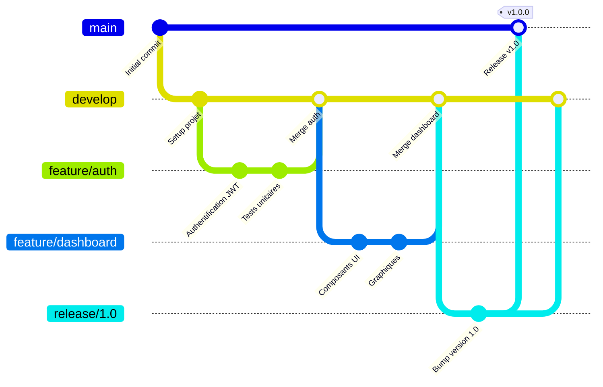
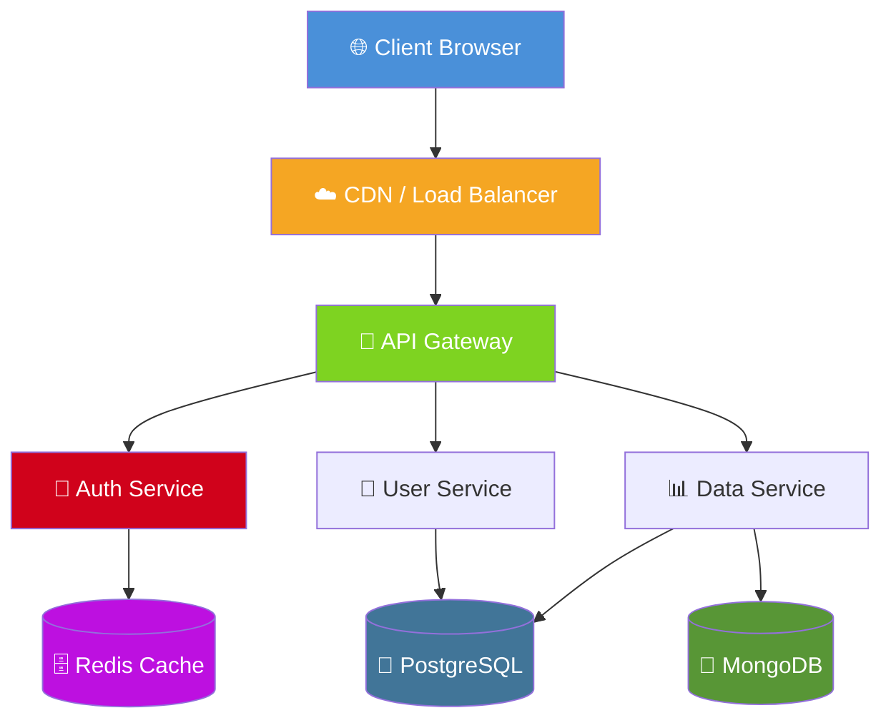
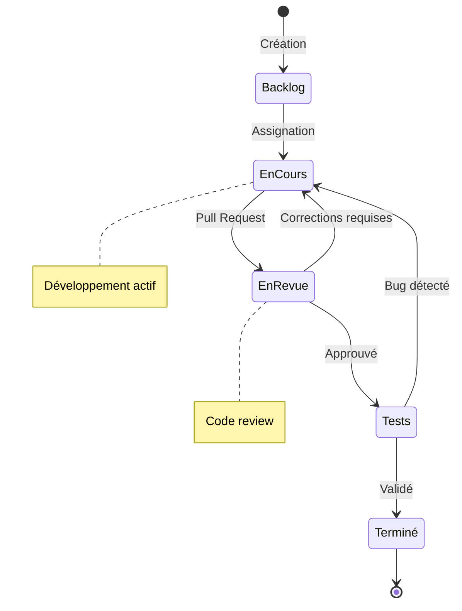

# 📘 Guide Complet du Markdown

> **Document de démonstration** — Créé pour illustrer toutes les fonctionnalités du langage Markdown.

---

## Table des Matières

- [1. Introduction](#introduction)
- [2. Mise en Forme du Texte](#mise-en-forme-du-texte)
- [3. Listes et Listes Imbriquées](#listes-et-listes-imbriquées)
- [4. Tableau de Données](#tableau-de-données)
- [5. Citations](#citations)
- [6. Liste de Tâches](#liste-de-tâches)
- [7. Blocs de Code](#blocs-de-code)
- [8. HTML Inline](#html-inline)
- [9. Diagramme Mermaid](#diagramme-mermaid)

---

## 1. Introduction {#introduction}

Bienvenue dans ce **guide complet du Markdown**. Ce document démontre les principales fonctionnalités de ce langage de balisage léger, utilisé pour la rédaction de documentation, de README, de blogs et bien plus encore.


*Figure 1 — Le logo officiel du Markdown, créé par Dustin Curtis.*

Liens utiles :
- 🔗 [Documentation officielle Markdown](https://www.markdownguide.org)
- 🔗 [Spécification CommonMark](https://commonmark.org)
- 🔗 [GitHub Flavored Markdown](https://github.github.com/gfm/)

Badges de statut :


---

## 2. Mise en Forme du Texte {#mise-en-forme-du-texte}

Le Markdown supporte plusieurs styles typographiques :

- **Texte en gras** : utilisez `**double astérisques**`
- *Texte en italique* : utilisez `*simple astérisque*`
- ***Texte gras et italique*** : utilisez `***triple astérisques***`
- ~~Texte barré~~ : utilisez `~~double tilde~~`
- `Code inline` : utilisez les backticks

---

## 3. Listes et Listes Imbriquées {#listes-et-listes-imbriquées}

### Liste non ordonnée simple

- Fruits
- Légumes
- Produits laitiers

### Liste ordonnée

1. Premièrement, analyser le problème
2. Deuxièmement, concevoir la solution
3. Troisièmement, implémenter le code
4. Quatrièmement, tester et valider

### Liste imbriquée (multi-niveaux)

- **Technologies Web**
  - Front-end
    - HTML
    - CSS
      - Flexbox
      - Grid
    - JavaScript
      - React
      - Vue.js
  - Back-end
    - Node.js
    - Python
      - Django
      - FastAPI
    - Java
  - Base de données
    - Relationnelle : PostgreSQL, MySQL
    - NoSQL : MongoDB, Redis

---

## 4. Tableau de Données {#tableau-de-données}

### Tableau des Employés — Entreprise TechCorp SA

| ID  | Nom              | Département     | Poste              | Salaire (€) | Années d'exp. |
|-----|------------------|-----------------|--------------------|-------------|---------------|
| 001 | Alice Martin     | Ingénierie      | Lead Developer     | 72 000      | 8             |
| 002 | Bob Dupont       | Marketing       | Chef de Projet     | 58 000      | 5             |
| 003 | Clara Fontaine   | Design          | UI/UX Designer     | 54 000      | 4             |
| 004 | David Leclerc    | Ingénierie      | DevOps Engineer    | 68 000      | 6             |
| 005 | Emma Rousseau    | RH              | DRH                | 62 000      | 10            |
| 006 | François Bernard | Direction       | CTO                | 110 000     | 15            |

*Tableau 1 — Données fictives des employés de TechCorp SA (2024).*

---

## 5. Citations {#citations}

### Citations simples

> « La simplicité est la sophistication suprême. »
> — *Léonard de Vinci*

> Le Markdown a été créé par **John Gruber** en 2004 avec l'aide d'Aaron Swartz. Son objectif principal était de permettre aux gens d'écrire en utilisant un format texte brut facile à lire, qui pourrait ensuite être converti en HTML structurellement valide.

### Citation imbriquée

> **Note de l'éditeur :**
>
> > « Tout ce qui peut être écrit peut être simplifié. »
>
> Cette citation illustre parfaitement la philosophie du Markdown.

---

## 6. Liste de Tâches {#liste-de-tâches}

### Projet : Refonte du Site Web

#### Phase 1 — Planification
- [x] Définir les objectifs du projet
- [x] Réaliser l'audit de l'existant
- [x] Établir le cahier des charges
- [ ] Valider le budget avec la direction
- [ ] Constituer l'équipe projet

#### Phase 2 — Conception
- [x] Créer les wireframes
- [ ] Concevoir la charte graphique
- [ ] Développer les maquettes haute fidélité
- [ ] Obtenir la validation client

#### Phase 3 — Développement
- [ ] Configurer l'environnement de développement
- [ ] Développer le front-end
- [ ] Intégrer le CMS
- [ ] Connecter les APIs
- [ ] Rédiger les tests unitaires

#### Phase 4 — Déploiement
- [ ] Tests d'intégration
- [ ] Recette utilisateur (UAT)
- [ ] Migration des données
- [ ] Mise en production
- [ ] Formation des utilisateurs

---

## 7. Blocs de Code {#blocs-de-code}

### Python — Algorithme de tri rapide

```python
def quicksort(arr: list) -> list:
    """
    Tri rapide (QuickSort) — Complexité moyenne O(n log n).
    
    Args:
        arr: La liste à trier
    Returns:
        Une nouvelle liste triée
    """
    if len(arr) <= 1:
        return arr
    
    pivot = arr[len(arr) // 2]
    left   = [x for x in arr if x < pivot]
    middle = [x for x in arr if x == pivot]
    right  = [x for x in arr if x > pivot]
    
    return quicksort(left) + middle + quicksort(right)

# Exemple d'utilisation
nombres = [3, 6, 8, 10, 1, 2, 1]
print(quicksort(nombres))  # → [1, 1, 2, 3, 6, 8, 10]
```

### JavaScript — Appel API avec async/await

```javascript
/**
 * Récupère les données utilisateur depuis une API REST.
 * @param {number} userId - L'identifiant de l'utilisateur
 * @returns {Promise<Object>} Les données de l'utilisateur
 */
async function fetchUser(userId) {
  try {
    const response = await fetch(`https://api.example.com/users/${userId}`, {
      method: 'GET',
      headers: {
        'Content-Type': 'application/json',
        'Authorization': `Bearer ${process.env.API_TOKEN}`
      }
    });

    if (!response.ok) {
      throw new Error(`Erreur HTTP : ${response.status}`);
    }

    const data = await response.json();
    return data;
  } catch (error) {
    console.error('Impossible de récupérer l\'utilisateur :', error);
    throw error;
  }
}

// Utilisation
fetchUser(42).then(user => console.log(user.name));
```

### SQL — Requête complexe

```sql
-- Rapport des ventes par département et trimestre
SELECT
    d.nom_departement,
    EXTRACT(QUARTER FROM v.date_vente) AS trimestre,
    COUNT(v.id)                         AS nb_ventes,
    SUM(v.montant)                      AS chiffre_affaires,
    AVG(v.montant)                      AS panier_moyen
FROM ventes v
    INNER JOIN employes e ON v.employe_id = e.id
    INNER JOIN departements d ON e.departement_id = d.id
WHERE
    v.date_vente BETWEEN '2024-01-01' AND '2024-12-31'
    AND v.statut = 'validee'
GROUP BY
    d.nom_departement,
    EXTRACT(QUARTER FROM v.date_vente)
ORDER BY
    d.nom_departement,
    trimestre;
```

### Bash — Script de déploiement

```bash
#!/bin/bash
# deploy.sh — Script de déploiement automatisé

set -e  # Arrêt en cas d'erreur

APP_NAME="monapp"
DEPLOY_DIR="/var/www/${APP_NAME}"
BACKUP_DIR="/var/backups/${APP_NAME}"
TIMESTAMP=$(date +"%Y%m%d_%H%M%S")

echo "🚀 Début du déploiement de ${APP_NAME}..."

# Sauvegarde
echo "📦 Sauvegarde en cours..."
cp -r "${DEPLOY_DIR}" "${BACKUP_DIR}/backup_${TIMESTAMP}"

# Déploiement
echo "⬇️  Récupération du code..."
git -C "${DEPLOY_DIR}" pull origin main

# Installation des dépendances
echo "📚 Installation des dépendances..."
cd "${DEPLOY_DIR}" && npm ci --production

# Redémarrage
echo "🔄 Redémarrage du service..."
systemctl restart "${APP_NAME}"

echo "✅ Déploiement terminé avec succès !"
```

---

## 8. HTML Inline {#html-inline}

Le Markdown supporte l'insertion de balises HTML directement dans le texte.

<div style="background-color: #f0f8ff; border-left: 4px solid #0078d4; padding: 12px 16px; border-radius: 4px; margin: 16px 0;">
  <strong>ℹ️ Information importante</strong><br>
  Cette boîte d'alerte est créée avec du HTML inline dans un document Markdown. Elle illustre comment combiner les deux syntaxes pour obtenir une mise en forme avancée.
</div>

<table>
  <thead>
    <tr style="background-color: #0078d4; color: white;">
      <th style="padding: 8px 12px;">Technologie</th>
      <th style="padding: 8px 12px;">Type</th>
      <th style="padding: 8px 12px;">Popularité</th>
    </tr>
  </thead>
  <tbody>
    <tr>
      <td style="padding: 8px 12px;"><strong>React</strong></td>
      <td style="padding: 8px 12px;">Framework JS</td>
      <td style="padding: 8px 12px;">⭐⭐⭐⭐⭐</td>
    </tr>
    <tr style="background-color: #f5f5f5;">
      <td style="padding: 8px 12px;"><strong>Vue.js</strong></td>
      <td style="padding: 8px 12px;">Framework JS</td>
      <td style="padding: 8px 12px;">⭐⭐⭐⭐</td>
    </tr>
    <tr>
      <td style="padding: 8px 12px;"><strong>Django</strong></td>
      <td style="padding: 8px 12px;">Framework Python</td>
      <td style="padding: 8px 12px;">⭐⭐⭐⭐</td>
    </tr>
  </tbody>
</table>

<br>

<details>
  <summary><strong>Cliquez pour révéler un contenu masqué</strong></summary>
  <p>Ce contenu est caché par défaut grâce à la balise HTML <code>&lt;details&gt;</code>. C'est très utile pour les FAQ ou les sections optionnelles d'un document.</p>
</details>

---

## 9. Diagramme Mermaid {#diagramme-mermaid}

### Flux de Développement Logiciel (GitFlow)



### Architecture du Système



### Cycle de Vie d'une Tâche



---

*Document généré le 26 mars 2026 — Format Markdown v1.0*
